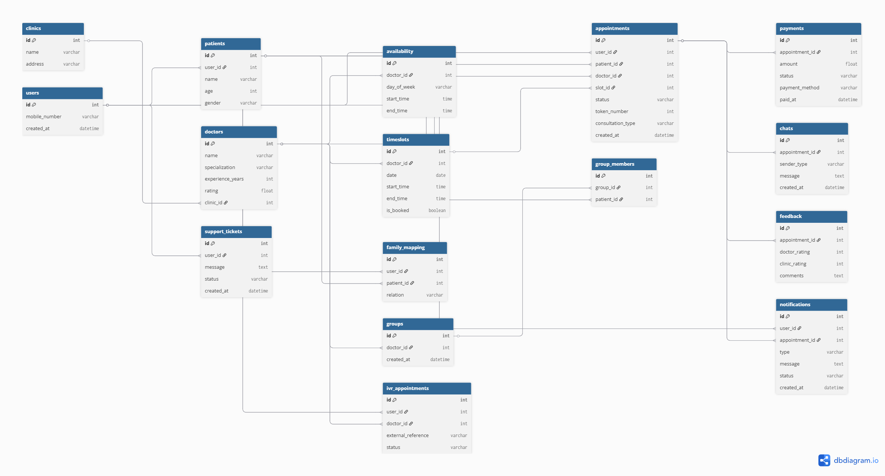

# Schedula ER Design – Step 1: Requirement Extraction

## System Overview

The system is a healthcare appointment platform that allows users to search for doctors, book appointments, manage multiple patient profiles (family members), make payments, communicate with doctors, and receive notifications and reminders.

---

## Modules Identified

1. User Authentication

   * Mobile-based login and registration

2. Doctor Management

   * Browse doctors, view profiles, experience, and availability

3. Appointment Booking

   * Select date, time slot, and consultation type

4. Time Slot Management

   * Slot-based booking to prevent double booking

5. Patient Management

   * Capture patient details (name, age, gender, complaints)

6. Family Profiles

   * One user can manage multiple patients (self, family members)

7. Payment System

   * Online consultation fee payment

8. Chat System

   * Communication between doctor and patient

9. Feedback System

   * Ratings for doctor, clinic, and experience

10. Notification System

* Appointment reminders, cancellations, and re-engagement messages

11. Support System

* User support tickets (open/resolved)

12. External Booking (IVR Integration)

* Appointment booking via external systems

13. Community / Co-patient System

* Patients grouped for shared interactions

---

## Key Entities Identified

* User
* Doctor
* Clinic
* Availability
* TimeSlot
* Appointment
* Patient
* FamilyMapping
* Payment
* Chat
* Feedback
* Notification
* SupportTicket
* IVRAppointment
* Group / CoPatient

---

## Key Observations & Design Insights

* A single user can manage multiple patient profiles, requiring separation of User and Patient entities
* Appointment acts as the central entity connecting booking, payment, chat, and feedback
* TimeSlot abstraction is required to prevent double booking and manage availability efficiently
* Notifications are event-driven and support reminders, cancellations, and re-engagement flows
* The system supports both direct booking and external (IVR-based) appointment creation
* Doctor availability and actual time slots must be handled separately to support scalability and flexibility

# Relationships 

* User (1) → (M) Patient
* User (1) → (M) Appointment
* Patient (1) → (M) Appointment
* Doctor (1) → (M) Availability
* Doctor (1) → (M) TimeSlot
* TimeSlot (1) → (1) Appointment
* Appointment (1) → (1) Payment
* Appointment (1) → (1) Feedback
* Appointment (1) → (M) Chat
* User (1) → (M) Notification
* User (1) → (M) SupportTicket
* Doctor (M) → (1) Clinic
* User (1) → (M) FamilyMapping
* Patient (1) → (M) FamilyMapping
* Doctor (1) → (M) Group
* Group (1) → (M) GroupMembers
* Patient (1) → (M) GroupMembers

## Live Diagram
https://dbdiagram.io/d/Schedula-Healthcare-Appointment-System-ER-Diagram-69d5ffc88089629684447dc9

## ER Diagram

The following diagram represents the database design of the Schedula healthcare appointment system.

